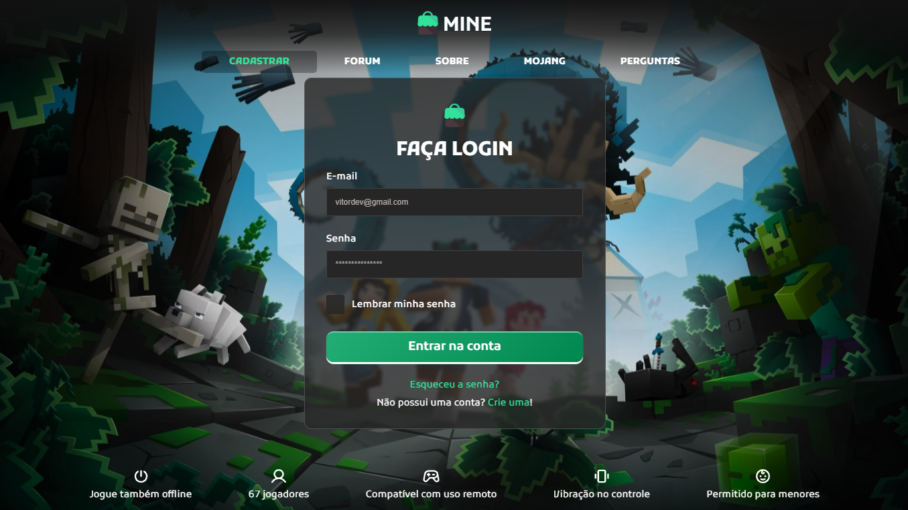
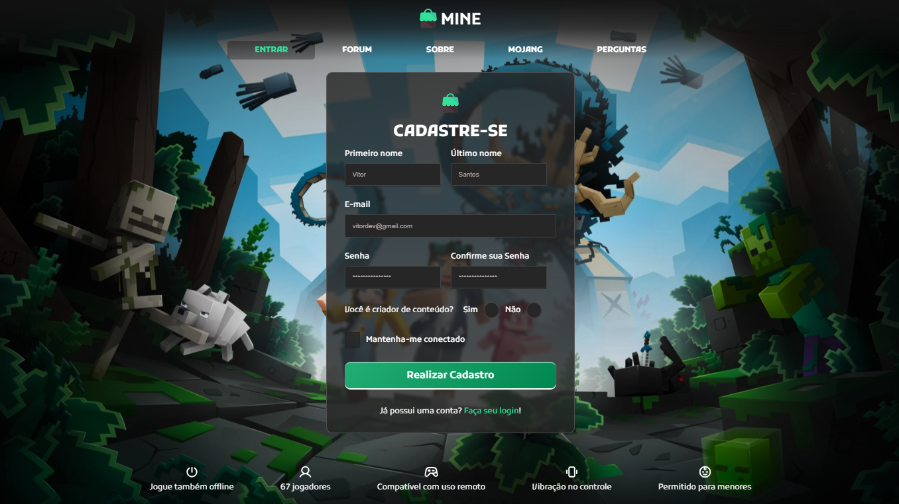

# Mine Community

## ❓ Sobre

Projeto visual de tela de Login e Cadastro, aplicando conceitos avançados de validação de formulários utilizando React Hook Form + Zod.
Protótipo da tela de login fornecido pelo Desafio 32 da Codelândia, comunidade do Iuri Silva.

---

## ⭐ Conceitos e Tecnologias

- ReactJS
- ViteJS
- Stitches
- React-Router-Dom
- React Hook Forms
- Zod
- Composition Pattern
- GIT
- Gitmoji
- Figma
- Commits semânticos

---

## 🖥 Visualização

---

---

    <a style="color: #195BBD;" href="https://mine-community.vercel.app/">Link de Visualização</a>
    
 &copy; Vitor Santos

